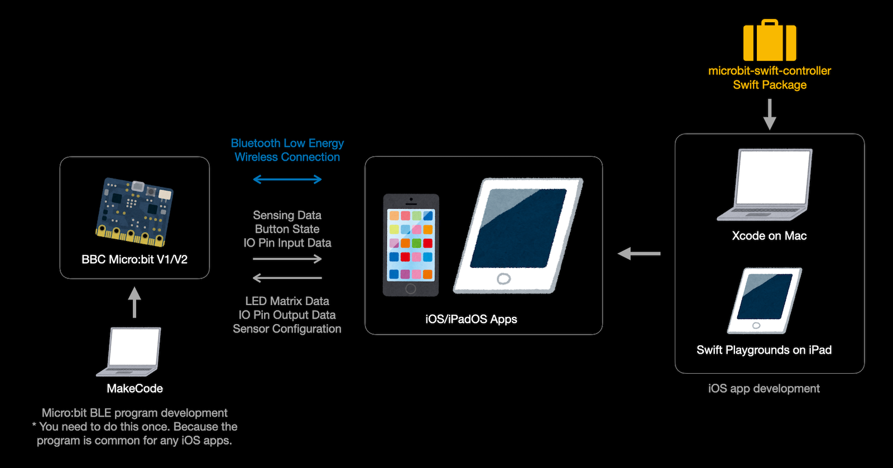
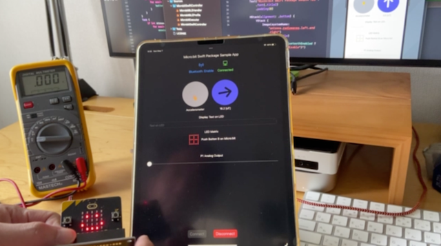
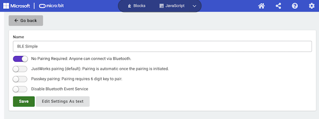
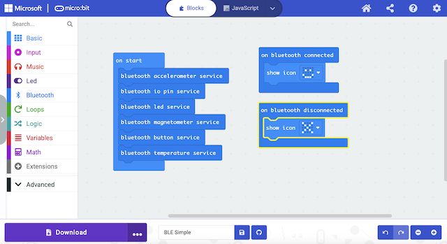
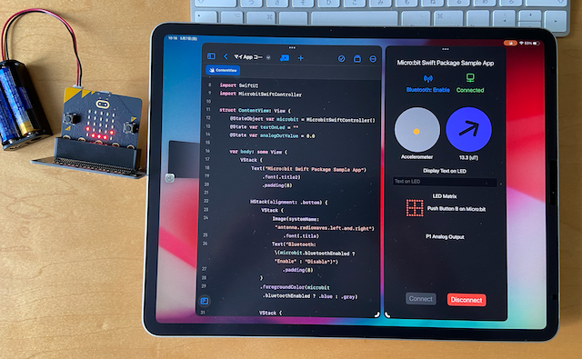

# Sample App for microbit-swift-controller Swift Package

A sample iOS app for the microbit-swift-controller Swift Package.

- Target devices: iPhone / iPad / Mac with M1/M2 (Designed for iPad)
- Target OS: iOS 16.0+, iPadOS 16.0+, macOS 13.0+
- Build system: Xcode 14.3+
- SDK: CoreBluetooth
- Swift Package: microbit-swift-controller https://github.com/ynagatomo/microbit-swift-controller
- BBC Micro:bit: V1/V2

The Swift Package, microbit-swift-controller, helps you create apps that interact with BBC Micro:bit via BLE.

The Micro:bit runs a general BLE peripheral program that enables BLE services you want such as LED, ACCELEROMETER, and IO PIN.
Once you download the program into your Micro:bit, you can use it commonly for any iOS apps that communicate with the BLE services.

By using the Apple CoreBluetooth framework, you can make any apps that communicate with Micro:bit via BLE.
However, you need to follow many procedures to match the Micro:bit's BLE Profile requirements.

This swift package provide two levels APIs to make easy creating such apps.

1. State-less Synchronous APIs ... With these APIs, you don't need to care about BLE states and Asynchronous behaviour. This is suitable for programming education for beginners.
1. State-full Asynchronous APIs ... With these APIs, you can handle precise BLE states and errors. You use Swift Concurrency for their asynchronous functions.

This project provides a sample iOS app using State-less Synchronous APIs.

## Prepare your Micro:bit

With MakeCode,

1. Enable `No Pairing Required` at Project Settings

This allows anyone connect your Micro:bit via bluetooth. It makes easy to connect with iOS apps.

2. Make your BLE program and download it into your Micro:bit.

Enable any bluetooth services you want like a led service.
Don't use Music functions if you will use P0 IO Pin because Music function uses the Pin.

Download the program into your Micro:bit.
You need to do this once first. 
The program will be used for any iOS apps that communicate with the BLE services you chose.

## Run the sample iOS app

Build this project and run it on iPhone or iPad.
When tapping `Connect` button, it will connect to a Micro:bit found first.

If it failed, please check Micro:bit program and settings, `No Pairing Required`.

## Considerations

1. Running on macOS

This project's app can run on macOS by build for Mac (Designed for iPad).

2. Developing with Swift Playgrounds on iPad

You can import the Swift Package, microbit-swift-controller, into the Swift Playgrounds project.
Make a similar app like this project and you can build it on iPad.

## References

1. BBC micro:bit Bluetooth Profile, Lancaster University: https://lancaster-university.github.io/microbit-docs/ble/profile/

License: MIT
