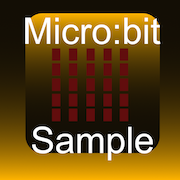

# Sample App for microbit-swift-controller Swift Package

A sample iOS app for the microbit-swift-controller Swift Package.

- Target devices: iPhone / iPad / Mac with M1/M2 (Designed for iPad)
- Target OS: iOS 16.0+, iPadOS 16.0+, macOS 13.0+
- Build system: Xcode 14.3+
- SDK: CoreBluetooth
- Swift Package: microbit-swift-controller https://github.com/ynagatomo/microbit-swift-controller

License: MIT
